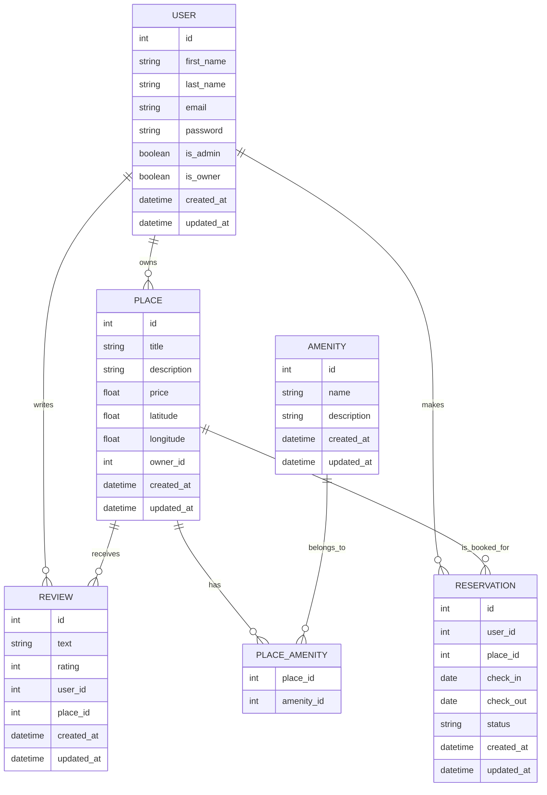

```mermaid
    erDiagram
        USER {
            int id
            string first_name
            string last_name
            string email
            string password
            boolean is_admin
            boolean is_owner
            datetime created_at
            datetime updated_at
        }

        PLACE {
            int id
            string title
            string description
            float price
            float latitude
            float longitude
            int owner_id
            datetime created_at
            datetime updated_at
        }

        REVIEW {
            int id
            string text
            int rating
            int user_id
            int place_id
            datetime created_at
            datetime updated_at
        }

        AMENITY {
            int id
            string name
            string description
            datetime created_at
            datetime updated_at
        }

        PLACE_AMENITY {
            int place_id
            int amenity_id
        }

    RESERVATION {
            int id
            int user_id
            int place_id
            date check_in
            date check_out
            string status
            datetime created_at
            datetime updated_at
        }

        USER ||--o{ PLACE : owns
        USER ||--o{ REVIEW : writes
        USER ||--o{ RESERVATION : makes
        PLACE ||--o{ REVIEW : receives
        PLACE ||--o{ PLACE_AMENITY : has
        PLACE ||--o{ RESERVATION : is_booked_for
        AMENITY ||--o{ PLACE_AMENITY : belongs_to
```